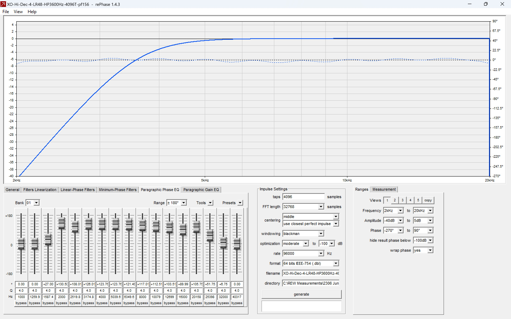

# CamillaDSP-Building-a-Config-4-Get-Excess-Phase-to-Zero
4. Manipulate the phase in rePhase for each driver to get the Excess Phase close to zero.

First a plot showing the Phase and SPL, with Excess Phase highlighted.

The aim is to have the Excess Phase at 0 on the Degree scale. Bass is OK but at 330Hz the phase starts dropping, so Mid and Hi need some tweaking as shown on the Spectrogram. The strong advice with rePhase is not to alter anything under 100Hz as it will induce pre-ringing. I leave the Bass driver alone in rePhase. We will create an excess phase version of the response in REW and export it and use rePhase to manipulate the phase and generate a filter that will make the Excess phase close to 0. Note the Excess Phase range , -270 to +90, as we will need to enter this range into rePhase.

Here is the spectrogram 

 
and Impulse (Step) responses

The Impulse step response plot is not too good, yet.

We need to extract a measurement of Excess Phase from the Full System (20-20kHz) measurement and Export it for input to rePhase. We will then use the previously saved rePhase XO settings for mid and hi drivers, import the Excess Phase measurement and manipulate the phase in Rephase to get the Excess Phase close to zero. We then replace the XO filter with the new XO and PF (Phase Fix) in the Pipeline. This way there is only one rePhase generated FIR filter per channel in the pipeline, remembering that each FIR filter adds a processing delay. 

So, back to our SPL and Phase plot, click the All SPL tab and make sure that only the wanted SPL measurement is shown, I deleted all the rest of the measurements.

**********
This appears complicated, so one way to better understand it is to download the REW plot and follow along in REW on your own pc. You will need REW and rePhase loaded. The REW measurement file is in the REW Measurements folder (Top of this page in the browser.) Click on the REW Measurements folder, then on the main screen, click on the .mdat file, then click on View raw, there will be a short pause then a save file dialog box will open, save the file to a folder on your computer and then open the file in REW. After opening the file in REW, adjust the frequency limits to 20-20,000Hz , then click the "Actions" box (top right) and the click "Generate minimum phase" and then "Generate and close"
********** 

Right click the thumbnail of the measurement (on the left) and select "Show actions", this will bring up the box (top left) headed "Actions for an individual measurement", where we select "Excess phase version". 

This will open a box (centre) headed "Excess phase copy" where we select Make excess phase copy. 

The "Make excess phase copy" will appear on the left margin with a suffix of -EP.  Click the "SPL & Phase" tab and then click on the new -EP graph. The graph may appear with little or no data, to fix this click the Limits icon and select Fit to data. You may need to "unwrap phase" using the "Actions" box" (at top right). 

Click File, then "Export", then "Export measurement as text", accept the next pop up 

and enter the file details and save the file.

Reload the crossover rePhase settings for Mid and click the Paragraphic Phase EQ tab, then in the slider panel click the Presets dropdown and select "Flat 1/3 oct Mid freq" to set the slider frequencies to usable mid range values, then up the top of the screen click "File", "Import Measurement" and select the Excess Phase measurement.

 

The Ranges and Measurement tabs (bottom right panel) need to be changed to get the data to display, in the Measurement tab I set gain offset to 0 to bring back the frequency response of the XO, in the Ranges tab I set the Phase at -270 to 90 corresponding to the REW measurement earlier.

Here is rePhase ready to manipulate the Excess Phase to 0 degrees

To manipulate the phase, select a frequency, check the Excess phase amount on the Y axis and either adjust the appropriate slider to get to 0 or enter the degree into the field. Degree, Q and Frequency can be entered. When you have the phase at 0 for the measurement, enter the new filename and confirm the directory then press generate to build a .dbl file, copy it to CamillaDSP and add the new filter in the pipeline, delete the old filter if needed and re-measure. Once more the filename is a descriptor showing details of the filter and Phase Fix identifier (156 was 15 June).

It took me a few goes to get to here, but it really doesn't take long. I have learnt from bitter experience to save the settings for each iteration of the measurements as it is then simple to go back a step when you stuff up.

Here is rePhase showing the Paragraphic Phase EQ for Mid at PF156 (PH156 means Phase Fix attempt on June 15).

RePhase for Hi showing the XO response and Excess Phase. (The ranges were altered the same as for Mid and the Presets dropdown menu set to "flat 1/3 oct high freq").

Here is rePhase showing the Paragraphic Phase EQ for Hi at PF156 (PH156 means Phase Fix attempt number 6 on June 15).

When you are satisfied with the manipulated phase, click the "generate" box and rePhase will build your FIR filter.

**********
If you are new to rePhase you can download a rePhase settings file from the rePhase Settings folder for one of the crossovers and then download the T31A XS Phase FS.txt file from the REW Measurements folder. Follow the instructions to smooth the phase.
The rePhase settings files are in the rePhase settings folder (Top of this page in the browser.) Click on the rePhase settings folder, then on the main screen, click on the .rephase file, then click on View raw, there will be a short pause then a save file dialog box will open, save the file to a folder on your computer and then open the file in rePhase - then click on a tab in the lower left pane, Linear Phase filters for the xo and Paragraphic Phase EQ for phase manipulation.
**********

The next step is to copy the XO PF files to  the CamillaDSP filters section.

Here is the CamillaDSP GUI with the Filters tab selected showing the XO filters.
 

In this next screengrab of filters in the config, again you can see my pedantic descriptor naming of XO filters and also the green + sign that is used to add a new filter.
CamillaDSP GUI, Filters tab showing FIR filters using the dbl files
 

OK, How does it look in REW - SPL unchanged, Phase looking good,  
 

Impulse (Step Response) showing a tiny bit of pre-ringing but I think that will be inaudible

Group Delay (GD) looks good

and finally the Spectrogram is as good as it gets with a 3 way horn system

The next stage is to further flatten the response by adding input PEQ filters.

https://github.com/wirrunna/CamillaDSP-Building-a-Config-5-Finishing-Touches
